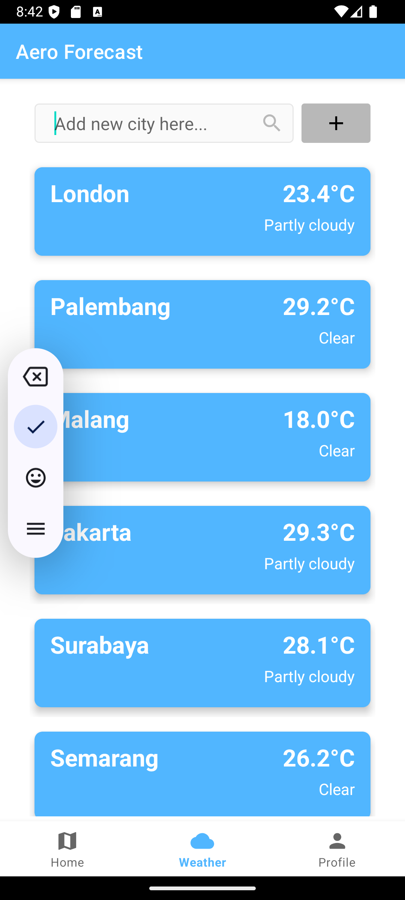

# WeatherForecast
This is a test project by using API key to display map and weather forecast. This project was made by Miftah D. S., Minarni Kukilo, M. Calvinros, and Y. M. Hawa. This app was a demonstration to make a simple app that has map in it, with added weather tab

# What it does?
This simple app can determine user location by using device GPS. This app can also show weather info from searched area in weather tab.

# App
This simple app has 3 front pages which is map tab that lead to the mobile map, weather tab, and a login page (without logic/any login method).

